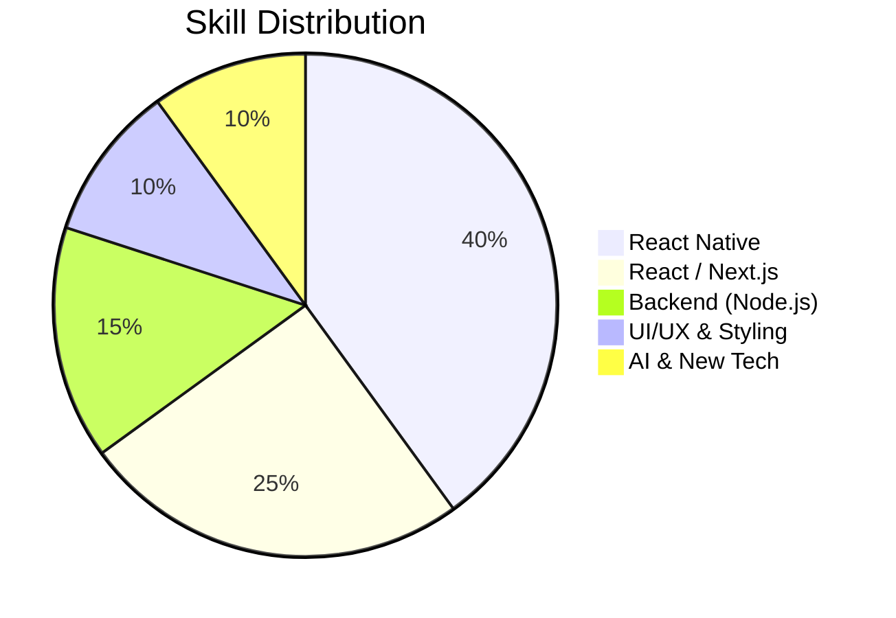

# 👋 Hi there! I'm Abdullah Al Maksud

---

## 🚀 About Me

* 📱 **React Native Developer** (Primary Focus)
* 🤖 Exploring **AI & Modern Technologies**
* 🎓 Master's in Physics @ Jahangirnagar University
* 💡 Passionate about building scalable & user-friendly apps
* 🎯 Goal: Become a high-impact Software Engineer

---

## 🧠 Current Focus

* ⚛️ React Native (Expo, Performance, UI Systems)
* 🌐 Full Stack (Next.js + API + DB)
* 🤖 AI Integration (AI-powered features in apps)
* 🧩 Reusable & scalable component architecture

---

## 🛠 Tech Stack

### 📱 Frontend & Mobile

### 🎨 Styling

### ⚙️ Backend & DB

### 🧰 Tools

---

## 📊 Skill Overview (Visual)

---

## 📈 GitHub Stats

  

  

  

---

## 🚀 What I'm Building

* 📱 Mobile Apps with **React Native (Expo)**
* 🧠 AI-powered features & integrations
* 🌍 Multilingual & scalable applications
* ⚡ Clean UI + performance-focused apps

---

## 🤝 Let's Connect

* 💼 LinkedIn: https://www.linkedin.com/in/abdullahalmaksud/
* 🐦 Twitter: https://twitter.com/aamaksud
* 💻 GitHub: https://github.com/abdullahalmaksud

---

⭐ *"Building smart apps with clean UI and powerful logic."*
