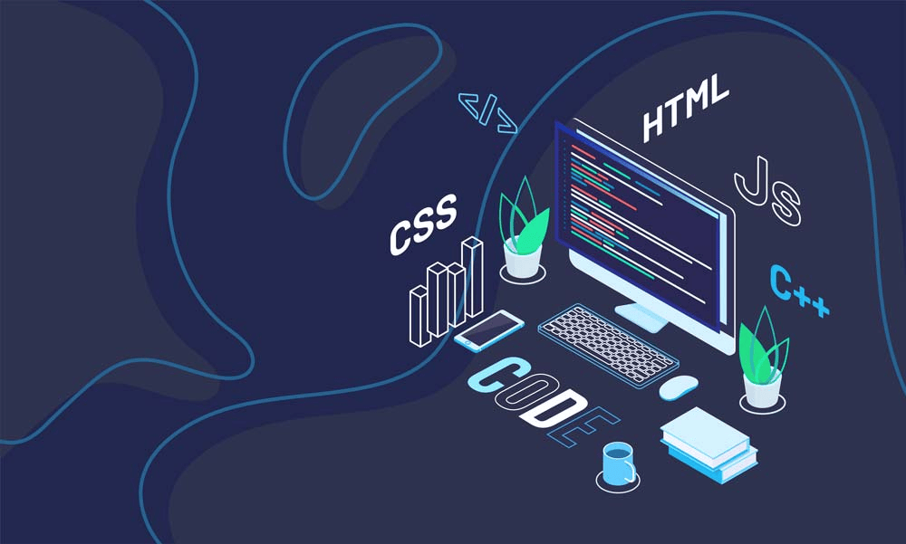

<!-- Dark/Light mode cover -->
<picture>
  <source media="(prefers-color-scheme: dark)" srcset="./assets/cover-dark.png">
  <source media="(prefers-color-scheme: light)" srcset="./assets/cover-light.png">
  
</picture>

<br/>

---

<h3 align="center" style="font-size: 1rem; font-weight: bold; text-align: center; line-height: 1.0;">
  Assalamu Alaikum 👋
</h3>
  <h2 align="center" style="font-size: 2rem; font-weight: light; text-align: center; line-height: 1.0;">I'm Abdullah Al Maksud</h2>

<!-- Dark/Light mode profile photo -->
<p align="center">
  <picture>
    <source media="(prefers-color-scheme: dark)" srcset="./assets/profile-dark.png">
    <source media="(prefers-color-scheme: light)" srcset="./assets/profile-light.png">
    
  </picture>
</p>

<p align="center">
  
</p>

<p align="center">
  
  
  
</p>

<br/>

---

## Engineer, Builder, Systems Thinker

I'm a React Native developer with professional experience since 2025, working on large-scale mobile applications in the EdTech and booking space — the kind that real users rely on every day. I've been part of the full journey: building features, handling localization, setting up authentication, and taking apps through the store release process.

Beyond mobile, I genuinely enjoy the frontend world. Next.js, TypeScript, Tailwind, and shadcn/ui are tools I reach for often, and I've taken multiple personal projects all the way from an empty repo to a live, deployed product. I pay close attention to how things look and feel — clean interfaces matter to me, not just clean code.

Lately, I've been exploring how AI APIs can be woven into products in ways that actually make a difference. I've shipped a few tools using Gemini and Claude APIs, and I'm still learning every day.

Oh, and I studied Physics — Honours from National University, Bangladesh, followed by an M.Sc. from Jahangirnagar University. That background taught me how to think through problems before jumping to solutions, which turns out to be pretty useful in software too.

---

## At a Glance

- 📱 **React Native Developer** — Professional experience on large-scale mobile products (EdTech & Booking)
- 🌐 **Frontend Engineer** — Next.js, TypeScript, Tailwind CSS; from repo init to production deploy
- 🤖 **AI Explorer** — Building real-utility tools with Gemini & Claude APIs
- 🧩 **Architecture-minded** — Reusable components, clean code, best practices first
- 🎨 **UI-obsessed** — Design-aware developer who cares deeply about what users actually see and feel
- 🔬 **Physics background** — B.Sc. (Hons) & M.Sc. graduate; trained to think in systems, not just syntax
- 🎯 **Goal** — Become a high-impact engineer who ships things that matter

---

## I Code With

<p align="center">
  
</p>

---

## Current Focus

```text
📱  React Native    ████████████░░░   Expo · NativeWind · i18next · Better Auth
🌐  Web / Frontend  ██████████░░░░░   Next.js · TypeScript · Tailwind · shadcn/ui
🤖  AI Integration  ████████░░░░░░░   Gemini API · Claude API · real-world use cases
⚙️  Backend         ██████░░░░░░░░░   Node.js · Express.js · Hono · MongoDB
```

---

## Tech Stack

<p>
  
  
  
  
  
  
  
  
  
  
  
</p>

---

## Education

**Master of Science in Physics**
Jahangirnagar University, Savar, Dhaka
_Sharpened my ability to model complex systems, think analytically under uncertainty, and approach problems from first principles — all of which quietly inform how I write and structure software._

**Bachelor of Science (Honours) in Physics**
National University, Bangladesh
_Where the habit of asking "why does this actually work?" began._

**Self-taught Software Engineer**
_Running parallel to my academic years — starting from web fundamentals, progressing through the React ecosystem, and stepping into professional mobile development. Every project has been a deliberate experiment._

---

## GitHub Stats

<p align="center">
  
  
</p>

<p align="center">
  
</p>

<p align="center">
  
</p>

<p align="center">
  
</p>

---

## Contribution Playground

<picture data-importer="pacman">
  <source media="(prefers-color-scheme: dark)" srcset="https://raw.githubusercontent.com/AbdullahAlMaksud/AbdullahAlMaksud/pacman-output/pacman-contribution-graph-dark.svg?game=pacman">
  <source media="(prefers-color-scheme: light)" srcset="https://raw.githubusercontent.com/AbdullahAlMaksud/AbdullahAlMaksud/pacman-output/pacman-contribution-graph.svg?game=pacman">
  
</picture>

###


---

## Let's Connect

<p>
  <a href="#"></a>
  <a href="https://www.linkedin.com/in/abdullahalmaksud/"></a>
  <a href="#"></a>
  <a href="#"></a>
  <a href="mailto:your@email.com"></a>
</p>

<br/>

<p align="center">
  
</p>
